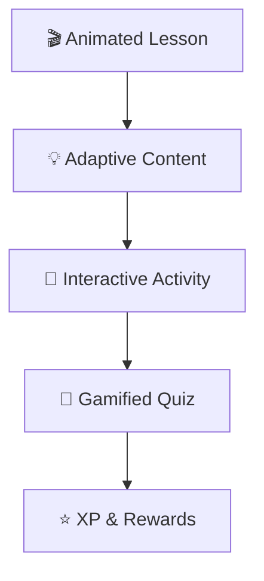

# 🧠 NeuroNest

### *Emotion-Aware, Gamified Learning Ecosystem for Every Unique Mind*

<p align="center">


</p>

---

## 🌟 Vision

**NeuroNest** transforms early education for neurodivergent children (ADHD, Autism, Dyslexia) into an **interactive, adaptive, and emotionally intelligent experience**.

It goes beyond content delivery — creating a system where children **learn, play, and grow** through sensory-friendly engagement and deep personalization.

---

## 🖼️ Platform Preview

<p align="center">
  
</p>

<p align="center">
  
</p>

---

## 🚀 Why NeuroNest?

✨ **Emotion-Aware Learning**
→ The platform adapts its recommendations and UI based on the child's mood (Happy, Calm, Tired, Anxious).

🎮 **Gamified Learning Loop**
→ Integrated XP system, target rewards, streaks, and achievement badges to keep engagement levels high.

🧠 **Micro-Learning Design**
→ Short, focused "Daily Quests" designed for better retention and reduced cognitive load.

🔁 **Connected Ecosystem**
→ Real-time synchronization between the Child Dashboard, Parent Control Center, and Teacher Command Hub.

---

## 🧩 Learning Flow



---

## 🛠️ Tech Stack

| Layer        | Technology                        |
| ------------ | --------------------------------- |
| 🎨 Frontend  | React.js + Lucide Icons           |
| ⚙️ Backend   | Spring Boot (Java) + Node.js (Notifications) |
| 🗄️ Database | MySQL + JPA/Hibernate             |
| 🧠 AI Brain  | Google Gemini 2.0 Flash           |
| 📧 Comms     | Nodemailer (Email Alerts)         |

---

## 📊 Key Highlights

* 🎯 **Specialized Games**: Focus-sharpening challenges for ADHD and emotion-literacy modules for Autism.
* 🧠 **Smart AI Fallback**: A hand-curated "Manual Mode" ensures the learning never stops even if the AI is offline.
* 🌈 **Sensory-Friendly UI**: Premium bubbly aesthetics with micro-animations and theme support.
* 📈 **Parental Insights**: High-level behavioral analytics and AI-driven recommendations for caregivers.

---

## 🔮 Future Scope

* 🤖 **AI Tutor**: Real-time voice interaction with an AI companion.
* 👨‍👩‍👧 **Multi-Child Support**: Managing multiple siblings from a single parent dashboard.
* 🌍 **Offline Mode**: Local synchronization for regions with limited internet.
* 📊 **Predictive Analytics**: Using AI to predict potential learning breakthroughs or burnout.

---

## 📌 Getting Started

1. **Clone the Repo**
   ```bash
   git clone https://github.com/Magg-peace/Neuro_Nest
   ```
2. **Setup Frontend**
   ```bash
   cd frontend
   # Add VITE_GEMINI_API_KEY to your .env
   npm install
   npm run dev
   ```
3. **Setup Backend**
   ```bash
   cd neuronest
   # Configure application.properties with your MySQL/Email credentials
   ./mvnw spring-boot:run
   ```
4. **Launch Everything**
   ```bash
   .\start_application.bat
   ```

---

## 🤝 Contributing

We welcome contributions that make learning more inclusive! 🚀

---

## 📜 License

Educational / Research Purpose

---

## 💡 Final Thought

> *“Because every mind thinks differently, and every difference is a strength.”*

---

**Built with 💛 by the NeuroNest Team.**
