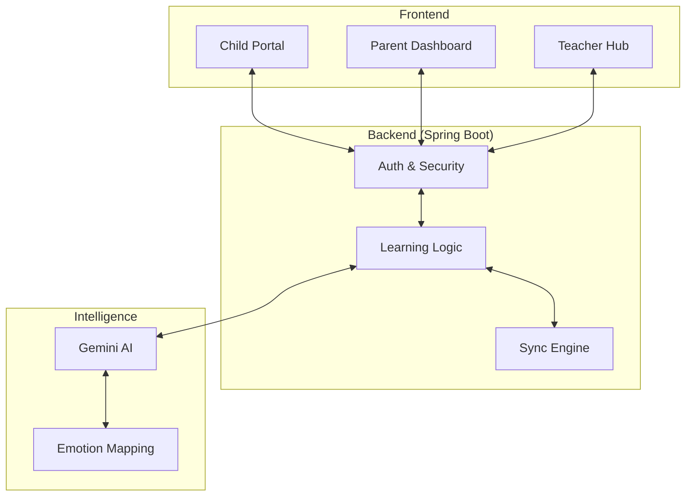

# 🧠 NeuroNest

### *Emotion-Aware, Gamified Learning Ecosystem for Every Unique Mind*

<p align="center">
  <a href="https://neuro-nest-amber.vercel.app/">
    
  </a>
  
  
</p>

---

## 🌟 Vision

**NeuroNest** transforms early education for neurodivergent children (ADHD, Autism, Dyslexia) into an **interactive, adaptive, and emotionally intelligent experience**. 

It goes beyond content delivery — creating a system where children **learn, play, and grow** through sensory-friendly engagement and deep AI-driven personalization.

---

## 🚀 Key Innovation Pillars

### 🎭 **Emotion-Aware Learning Engine**
The platform dynamically adapts its modules and UI based on the child's recorded mood. Whether they are **Happy, Calm, Tired, or Anxious**, NeuroNest adjusts the difficulty and sensory input to match their cognitive state.

### 🎮 **High-Stakes Gamification**
Integrated XP system, target rewards, streaks, and achievement badges. Children don't just "study"; they go on **"Animated Adventures"** to earn points for their virtual store.

### 🏢 **The Unified Trinity**
*   **Child World**: A safe, bubbly, and engaging interface for learning.
*   **Parent Hub**: Real-time behavioral tracking and AI-generated progress insights.
*   **Teacher Command**: Class-wide roster management and AI-driven intervention alerts.

---

## 🛠️ The Tech Stack

| Layer | Technology |
| :--- | :--- |
| **Frontend** | React 18 + Vite + Tailwind/Vanilla CSS |
| **Backend** | Spring Boot 3.x (Java 17) |
| **Architecture** | Dockerized Containers (Production Ready) |
| **Database** | MySQL (with H2 In-Memory Fallback) |
| **AI Brain** | Google Gemini 2.0 Flash (Adaptive Content) |
| **Deployment** | Vercel (Frontend) & Render (Backend) |

---

## 🧩 System Architecture



---

## 🐳 Docker Deployment (Render/Production)

NeuroNest is fully containerized for easy deployment.

```bash
# Build the production JAR
./mvnw clean package

# Run via Docker
docker build -t neuronest-backend .
docker run -p 8080:8080 -e PORT=8080 neuronest-backend
```

---

## 📌 Getting Started

### 1. Clone the Repo
```bash
git clone https://github.com/Magg-peace/Neuro_Nest
```

### 2. Launch Local Environment
We've included a one-click launcher for Windows users:
```bash
.\start_application.bat
```

### 3. Manual Setup
**Frontend:**
```bash
cd frontend && npm install && npm run dev
```
**Backend:**
```bash
cd neuronest && ./mvnw spring-boot:run
```

---

## 🤝 Roadmap & Future
*   **AI Voice Tutor**: Real-time safe-speech interaction.
*   **Predictive Burnout Detection**: Alerts parents before sensory overload occurs.
*   **Global Content Library**: Community-driven lesson modules for specific neuro-profiles.

---

## 📜 License & Credit
**Developed for the Hackathon Demo.**
*Built with 💛 by the NeuroNest Team.*

---

> *"Because every mind thinks differently, and every difference is a strength."*
